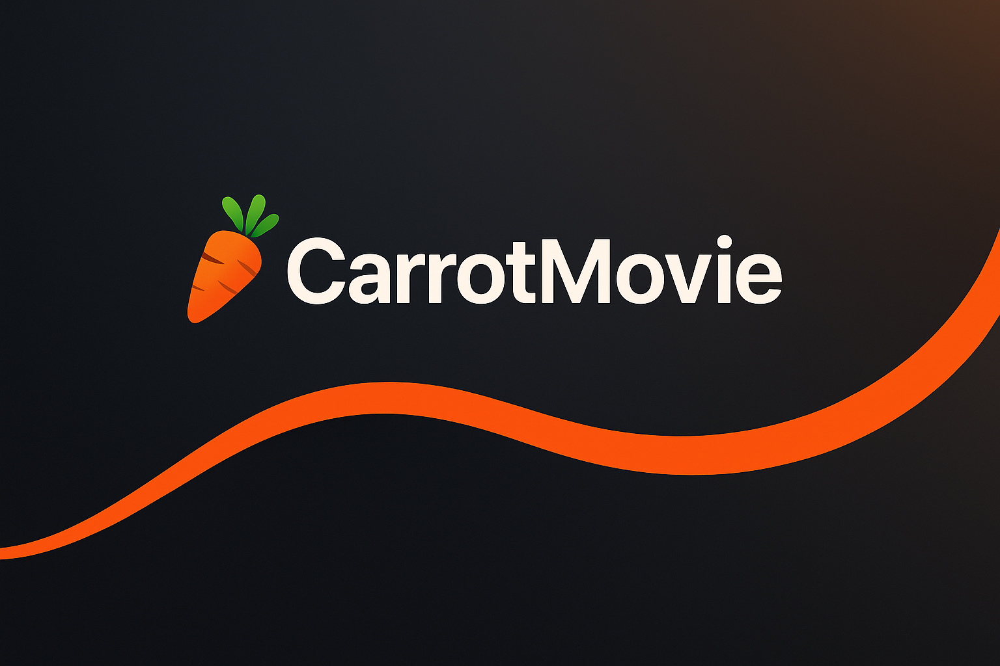
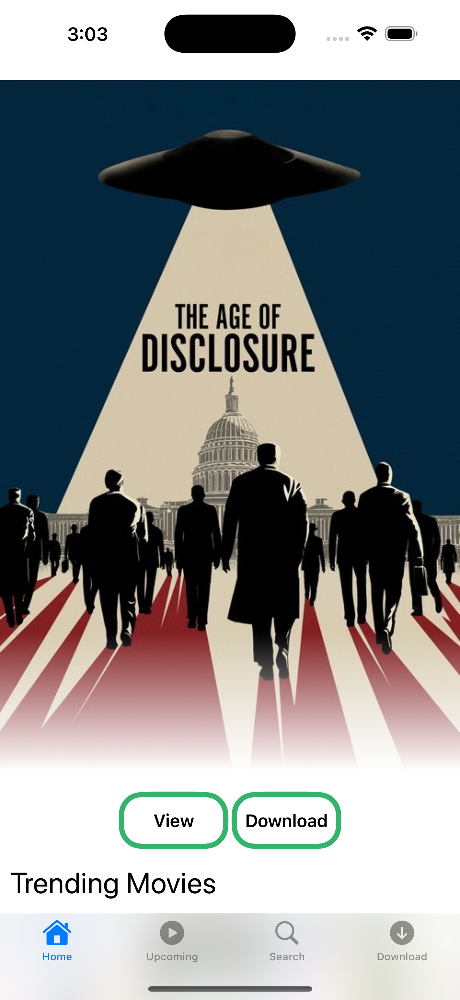
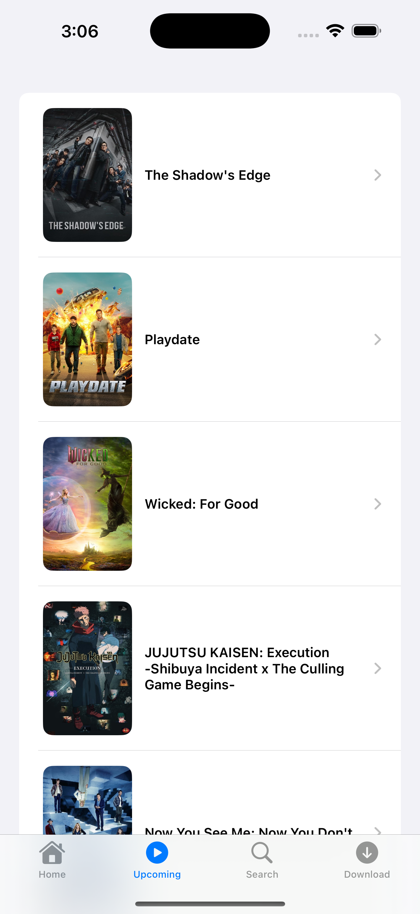
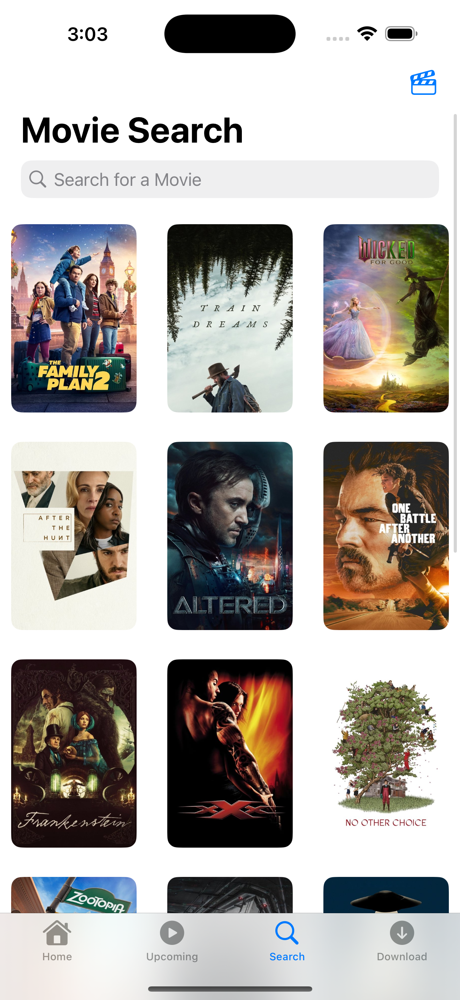
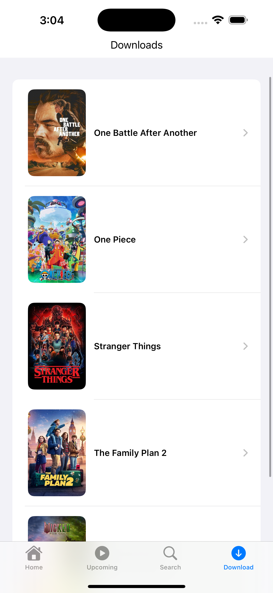

---

<p align="center">
  
  
  
  
  
  
</p>

---

# 🍿 Overview

**CarrotMovie** is a modern iOS movie-browsing app built with:

- **SwiftUI**
- **SwiftData**
- **MVVM Architecture**
- **TMDB API** for movie & TV metadata
- **YouTube Data API** for trailers
- **Async/Await networking**
- **WKWebView** for embedded trailer playback

This project was built as part of a tutorial, with added structure and enhancements to practice real-world app patterns.

---

# ✨ Features

### 🎬 Movie & TV Browsing
- Trending Movies
- Trending TV Shows
- Top Rated Movies
- Top Rated TV
- Upcoming Releases

### 🔍 Search
- Search Movies or TV Shows
- 500ms debounce
- Category toggle (Movies / TV)
- Live results

### 📺 Trailers
- Fetch trailer `videoId` via YouTube API
- Auto-play embedded player inside the app
- Responsive layout

### 📥 Downloads (SwiftData)
- Save titles using `@Model`
- Automatically show downloads using `@Query`
- Persistent local storage
- Delete saved titles

### 🧱 Architecture
- Fully separated **MVVM**
- Clean networking layer
- Generic decoding
- Strong error handling
- URL building with query items

---
# 🎥 Demo Video
https://github.com/karentran28/CarrotMovie/releases/download/v1.0.0/demo.mov

# 📸 Screenshots

| Home Screen | Upcoming |
|-------------|---------------|
|  |  |

| Search Screen | Downloads |
|---------------|-----------|
|  |  |

---

### Key Components

#### 🗂 Models
`Title`, `TMDBAPIObject`, `YoutubeSearchResponse`

#### 🔧 Networking
`DataFetcher.swift`
`APIConfig.swift`
`Errors.swift`
Generic `fetchAndDecode<T>()`

#### 📱 Views
`HomeView`, `SearchView`, `DownloadView`, `TitleDetailView`

#### 🧠 State
`ViewModel`
`SearchViewModel`

#### 🗃 Persistence
SwiftData with `@Model` and `@Query`.

---

# 🔧 Setup

### 1️⃣ Clone Repo

```bash
git clone https://github.com/karentran28/CarrotMovie.git
```

### 2️⃣ Create `APIConfig.json`

Inside the project folder:

```json
{
  "tmdbBaseURL": "https://api.themoviedb.org",
  "tmdbAPIKey": "YOUR_TMDB_API_KEY",

  "youtubeBaseURL": "https://www.youtube.com/embed",
  "youtubeSearchURL": "https://www.googleapis.com/youtube/v3/search",
  "youtubeAPIKey": "YOUR_YOUTUBE_API_KEY"
}
```

### 3️⃣ Add to `.gitignore`

```
APIConfig.json
```

### 4️⃣ Build & Run in Xcode

---

# 🧠 What I Learned

This project helped reinforce:

- MVVM architecture in SwiftUI
- Working with **SwiftData**
- Async/await networking
- URL building & query parameters
- Writing decodable models
- Embedding UIKit views (`WKWebView`)
- Debounced searching
- Error propagation using custom enums
- ATS and Info.plist configuration
- Managing state across multiple screens

---

# 🚀 Future Improvements

- Paging for search & category lists
- Caching for poster images
- Cast & crew details
- Improved YouTube trailer accuracy
- Custom animations
- Light/Dark mode support
- Unit tests for networking & view models

# 🙌 Credits

This project was built by following a tutorial created by [Blossom Build](https://www.youtube.com/watch?v=-VC3hIEL7eQ).
